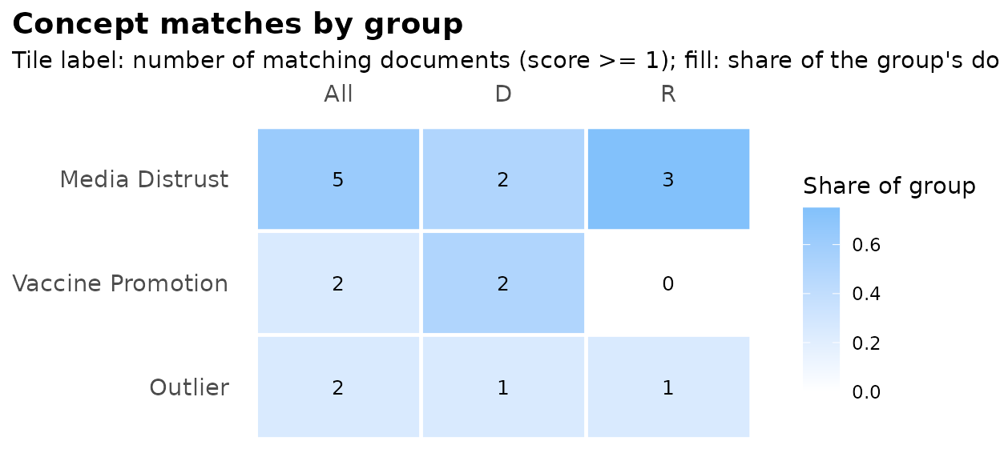

# Concept induction with lloomr

lloomr is an R implementation of the **LLooM** concept-induction
algorithm (Lam et al., 2024, CHI; Python package `text_lloom`). From a
collection of texts, it induces interpretable **concepts** — each a
short name plus a one-sentence inclusion criterion — and then scores
every document against every concept.

The pipeline:

1.  **Distill** — extract salient quotes (\[distill_filter()\],
    optional) and compress to bullet points (\[distill_summarize()\]).
2.  **Cluster** — embed bullets, reduce with UMAP, cluster with HDBSCAN
    (\[cluster_texts()\]).
3.  **Synthesize** — an LLM proposes named concepts per cluster
    (\[synthesize_concepts()\]).
4.  **Review** — remove weak concepts, merge overlaps, select the best
    (\[review_concepts()\]).
5.  **Score** — rate every document against every concept on a 5-point
    scale (\[score_concepts()\]).
6.  **Refine / loop** — drop generic or rare concepts
    (\[refine_concepts()\]), find uncovered documents (\[loop_docs()\]).

LLM calls go through [ellmer](https://ellmer.tidyverse.org) chat
objects, so any supported provider works; responses are constrained by
structured output schemas, not parsed out of free text.

## The session pipeline

The chunks below are not evaluated in this vignette (they call LLM
APIs); they show the canonical workflow. With an `OPENAI_API_KEY` set,
they run as-is.

``` r

library(lloomr)

# df has one row per document, with columns "text" and "doc_id"
sess <- lloom_session(df, text_col = "text", id_col = "doc_id")

# Estimate cost before spending anything
lloom_estimate_gen_cost(sess)

# Distill -> cluster -> synthesize -> review; activate the best 8 concepts.
# `seed` steers generation toward a topic of interest (optional);
# `sample_n` generates concepts from a sample while scoring stays full.
sess <- lloom_gen(sess, seed = "media trust", max_concepts = 8, sample_n = 200)
sess$concepts

# Score every document against the active concepts
sess <- lloom_score(sess)
score_df <- lloom_results(sess)

# Time, tokens, and dollars per step
summary(sess)
```

Every step is also a standalone function on plain data frames
([`distill_summarize()`](https://zilinskyjan.github.io/lloomr/reference/distill_summarize.md),
[`cluster_texts()`](https://zilinskyjan.github.io/lloomr/reference/cluster_texts.md),
[`synthesize_concepts()`](https://zilinskyjan.github.io/lloomr/reference/synthesize_concepts.md),
…) — the session is a convenience, not a requirement.

## Bring your own concepts (scoring a human codebook)

Concept *generation* is optional. If you already have a codebook —
theory-driven categories, concepts from a previous study, or hand-edited
output of an earlier run — you can use lloomr purely **deductively**:
write the concepts yourself and score every document against them. Each
concept just needs a name and a yes/no inclusion-criterion question:

``` r

codebook <- new_concepts(
  name = c("Economic Anxiety", "Media Distrust"),
  prompt = c(
    "Does the text express concern about economic conditions?",
    "Does the text express distrust toward news media?"
  ),
  active = TRUE
)

chat <- ellmer::chat_openai(model = "gpt-5.4-nano", echo = "none")
score_df <- score_concepts(df, "text", "doc_id", codebook, chat,
                           get_highlights = TRUE)
```

The same works inside a session — skip
[`lloom_gen()`](https://zilinskyjan.github.io/lloomr/reference/lloom_gen.md)
entirely and add concepts by hand:

``` r

sess <- lloom_session(df, "text", "doc_id")
sess <- lloom_add_concept(sess, "Economic Anxiety",
                          "Does the text express concern about economic conditions?")
sess <- lloom_add_concept(sess, "Media Distrust",
                          "Does the text express distrust toward news media?")
sess <- lloom_score(sess)
```

And for mutually exclusive categories, \[assign_topics()\] accepts a
plain character vector of topic names — no concept objects needed at
all.

## Multi-label scores, single-label topics

Scoring is **multi-label**: each (document, concept) pair is rated
independently, so a document can match several concepts or none. When a
mutually exclusive partition is needed, freeze a topic set and use one
of:

``` r

# Forced-choice LLM classification (labels constrained to your topic set)
assignments <- assign_topics(df, "text", "doc_id", sess$concepts, chat)

# Or: free, deterministic argmax over existing scores
slotted <- slot_by_score(score_df, "doc_id", threshold = 1)
```

## Visualizing results

\[lloom_vis()\] draws the concept-by-group heatmap (the R replacement
for the Python package’s interactive matrix widget). It needs only a
scored session, so we demonstrate with a small synthetic one — no API
calls:

``` r

docs <- data.frame(
  doc_id = as.character(1:8),
  text = paste("document", 1:8),
  party = rep(c("D", "R"), each = 4)
)
concepts <- new_concepts(
  name = c("Media Distrust", "Vaccine Promotion"),
  prompt = c("Distrusts media?", "Promotes vaccines?"),
  active = TRUE
)

# A synthetic score grid (in practice: lloom_score() / score_concepts())
score_df <- expand.grid(
  doc_id = docs$doc_id, concept_name = concepts$name,
  stringsAsFactors = FALSE
)
score_df$concept_id <- concepts$id[match(score_df$concept_name, concepts$name)]
score_df$text <- docs$text[match(score_df$doc_id, docs$doc_id)]
score_df$score <- c(1, 1, 0, 0, 1, 1, 1, 0,   # Media Distrust
                    0, 1, 1, 0, 0, 0, 0, 0)   # Vaccine Promotion
score_df$rationale <- ""
score_df$highlight <- ""
score_df$concept_seed <- NA_character_

sess <- lloom_session(docs, "text", "doc_id",
                      distill_chat = "unused", synth_chat = "unused",
                      score_chat = "unused")
sess$concepts <- concepts
sess$score_df <- score_df
```

``` r

lloom_vis(sess, slice_col = "party")
```



The underlying tidy matrix is available via \[concept_matrix()\] for
custom plots, and \[lloom_export()\] produces a per-concept evidence
table (criteria, prevalence, highlight quotes).

## Saving your results

The score table is a **plain data frame** — one row per (document,
concept) pair — so saving it is one ordinary line:

``` r

readr::write_csv(lloom_results(sess), "scores.csv")
```

That CSV has everything: document IDs, concept names, scores, the
model’s rationales, and highlight quotes.

For analysis you usually also want the **wide** version — one row per
document, one column per concept — to join onto your main dataset.
\[scores_wide()\] does the pivot and sanitizes concept names into valid
column names (continuing with the synthetic scores from above):

``` r

wide <- scores_wide(score_df, "doc_id")
wide
#> # A tibble: 8 × 3
#>   doc_id Media.Distrust Vaccine.Promotion
#>   <chr>           <dbl>             <dbl>
#> 1 1                   1                 0
#> 2 2                   1                 1
#> 3 3                   0                 1
#> 4 4                   0                 0
#> 5 5                   1                 0
#> 6 6                   1                 0
#> 7 7                   1                 0
#> 8 8                   0                 0

# The mapping from concept names to column names:
attr(wide, "concept_names")
#>      Media Distrust   Vaccine Promotion 
#>    "Media.Distrust" "Vaccine.Promotion"
```

Joining the scores back onto your data is then a regular merge — with
the row-count checks that any merge deserves:

``` r

stopifnot(nrow(wide) == nrow(docs))
merged <- dplyr::left_join(docs, wide, by = "doc_id")
stopifnot(nrow(merged) == nrow(docs))
head(merged, 3)
#>   doc_id       text party Media.Distrust Vaccine.Promotion
#> 1      1 document 1     D              1                 0
#> 2      2 document 2     D              1                 1
#> 3      3 document 3     D              0                 1
```

Finally, two one-liners for whole-analysis persistence:

``` r

# Everything at once: scores (long + wide), concepts, evidence table,
# and the full session object
lloom_write(sess, "results/")

# Or just the session; chat objects survive and keep working after reload
saveRDS(sess, "results/session.rds")
sess <- readRDS("results/session.rds")   # later, in a fresh R session
```

## Further reading

- Lam, M., et al. (2024). *Concept Induction: Analyzing Unstructured
  Text with High-Level Concepts Using LLooM.* CHI 2024.
  <https://doi.org/10.1145/3613904.3642830>
- Upstream Python package: <https://github.com/michelle123lam/lloom>
