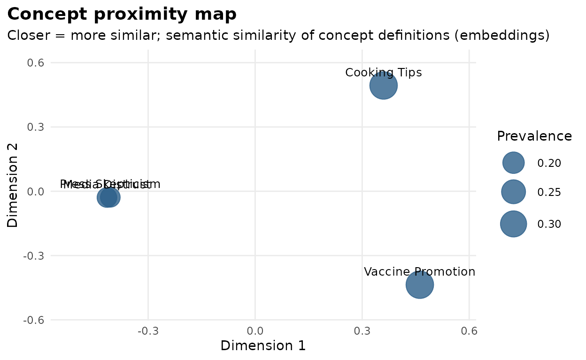
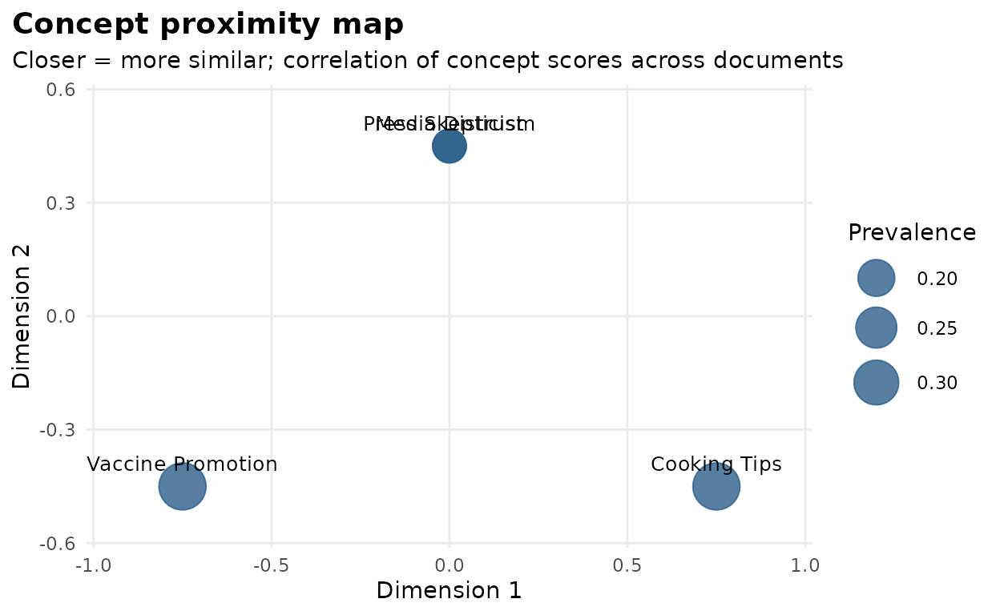
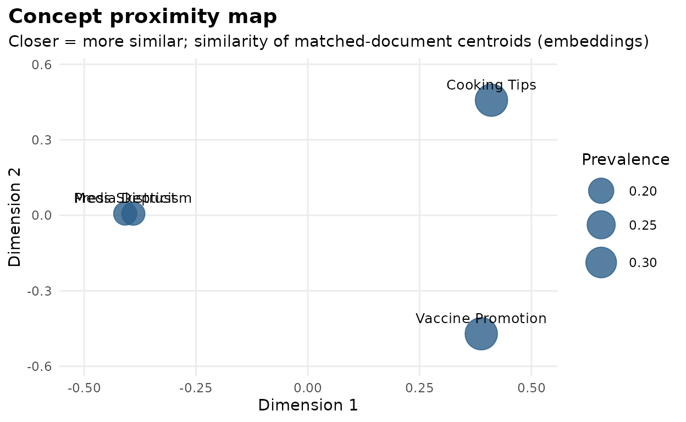

# Concept proximity analysis

After a LLooM analysis you hold a set of concepts. A natural next
question is structural: **how do the concepts relate to each other?**
Are two of them near-synonyms? Do they describe the same documents? Do
their matches come from the same corner of the corpus?

lloomr answers with three complementary similarity measures, all
available through
[`concept_similarity()`](https://zilinskyjan.github.io/lloomr/reference/concept_similarity.md)
and visualized with
[`lloom_concept_map()`](https://zilinskyjan.github.io/lloomr/reference/lloom_concept_map.md):

| Method | Question it answers | Inputs needed |
|----|----|----|
| `"embedding"` | Do the concept **definitions** mean similar things? | concepts only |
| `"scores"` | Do the concepts **fire on the same documents**? | scores |
| `"centroids"` | Do the concepts’ matches occupy the same **semantic territory**? | scores + document embeddings |

The three can disagree — and as this vignette shows, the disagreements
are where the insight is.

## A worked example with transparent embeddings

In real use, embeddings come from an API
([`ll_embed()`](https://zilinskyjan.github.io/lloomr/reference/ll_embed.md))
and scores from
[`lloom_score()`](https://zilinskyjan.github.io/lloomr/reference/lloom_score.md).
So that this vignette is self-contained, reproducible, and inspectable,
we instead use a **toy embedder**: it maps any text to three
interpretable dimensions — politics, health, food — by counting
keywords. Everything downstream works identically with real embeddings.

``` r

toy_embed <- function(texts) {
  dims <- list(
    politics = c("media", "press", "news", "journalist", "narrative"),
    health   = c("vaccine", "booster", "doctor", "health"),
    food     = c("bread", "recipe", "bake", "grill", "tomato")
  )
  emb <- sapply(dims, function(words) {
    sapply(texts, function(t) {
      sum(vapply(words, function(w) grepl(w, tolower(t)), logical(1)))
    })
  })
  emb <- matrix(emb, nrow = length(texts),
                dimnames = list(NULL, names(dims)))
  emb + 0.05  # avoid all-zero rows
}

toy_embed(c("The press buried the news story.",
            "Get your vaccine and booster.",
            "A foolproof bread recipe."))
#>      politics health food
#> [1,]     2.05   0.05 0.05
#> [2,]     0.05   2.05 0.05
#> [3,]     0.05   0.05 2.05
```

A small corpus with three semantic territories — and a deliberate twist
in how concepts will match it:

``` r

docs <- data.frame(
  doc_id = as.character(1:12),
  text = c(
    "The media keeps pushing one narrative.",            # media (1-4)
    "I do not trust the news anymore.",
    "Every press outlet runs identical stories.",
    "Journalists no longer question the powerful.",
    "Vaccines are safe and effective.",                  # health (5-8)
    "Get your booster, protect your family.",
    "My doctor recommended the new vaccine.",
    "Public health depends on vaccination.",
    "This bread recipe never fails.",                    # food (9-12)
    "Grill the tomatoes with a little oil.",
    "Bake at high heat for a crisp crust.",
    "The secret to great bread is patience."
  )
)
```

Four concepts. The twist: **“Media Distrust” and “Press Skepticism” are
near-synonyms, but we will score them so that they match *disjoint*
documents** (1–2 vs. 3–4). This happens in real analyses when review
fails to merge near-duplicates, or when two narrow criteria split one
underlying theme:

``` r

concepts <- new_concepts(
  name = c("Media Distrust", "Press Skepticism",
           "Vaccine Promotion", "Cooking Tips"),
  prompt = c(
    "Does the text express distrust toward news media?",
    "Is the text skeptical of the press and journalists?",
    "Does the text promote vaccines or boosters for health?",
    "Does the text share a recipe or food preparation advice?"
  ),
  active = TRUE
)

# Scores as lloom_score() would produce them (1 = strongly agree):
match_sets <- list(c("1", "2"), c("3", "4"), c("5", "6", "7", "8"),
                   c("9", "10", "11", "12"))
score_df <- do.call(rbind, lapply(seq_len(nrow(concepts)), function(i) {
  data.frame(
    doc_id = docs$doc_id,
    text = docs$text,
    concept_id = concepts$id[i],
    concept_name = concepts$name[i],
    concept_prompt = concepts$prompt[i],
    score = as.numeric(docs$doc_id %in% match_sets[[i]]),
    rationale = "", highlight = "", concept_seed = NA_character_
  )
}))

# Assemble a session around these pieces (in real use: lloom_gen() +
# lloom_score() fill these fields)
sess <- lloom_session(docs, "text", "doc_id",
                      distill_chat = "unused", synth_chat = "unused",
                      score_chat = "unused", embed_fn = toy_embed)
sess$concepts <- concepts
sess$score_df <- score_df
```

## View 1: semantic similarity of the definitions

`method = "embedding"` embeds each concept’s `"name: prompt"` text and
compares them. The two media concepts are near-identical here — their
*definitions* say almost the same thing:

``` r

sim_sem <- concept_similarity(concepts, method = "embedding",
                              embed_fn = toy_embed)
round(sim_sem, 2)
#>                   Media Distrust Press Skepticism Vaccine Promotion
#> Media Distrust              1.00             1.00              0.03
#> Press Skepticism            1.00             1.00              0.04
#> Vaccine Promotion           0.03             0.04              1.00
#> Cooking Tips                0.06             0.07              0.06
#>                   Cooking Tips
#> Media Distrust            0.06
#> Press Skepticism          0.07
#> Vaccine Promotion         0.06
#> Cooking Tips              1.00
```

``` r

lloom_concept_map(sess, method = "embedding")
```



## View 2: empirical co-matching

`method = "scores"` correlates the concepts’ score vectors across
documents — no embeddings involved, and no additional API cost. Now the
same two media concepts look **negatively** related: whenever one
matches a document, the other does not.

``` r

sim_scores <- concept_similarity(concepts, method = "scores",
                                 score_df = score_df, id_col = "doc_id")
round(sim_scores, 2)
#>                   Media Distrust Press Skepticism Vaccine Promotion
#> Media Distrust              1.00            -0.20             -0.32
#> Press Skepticism           -0.20             1.00             -0.32
#> Vaccine Promotion          -0.32            -0.32              1.00
#> Cooking Tips               -0.32            -0.32             -0.50
#>                   Cooking Tips
#> Media Distrust           -0.32
#> Press Skepticism         -0.32
#> Vaccine Promotion        -0.50
#> Cooking Tips              1.00
```

``` r

lloom_concept_map(sess, method = "scores")
```



If you stopped here, you might conclude the two media concepts measure
different things. The third view resolves the contradiction.

## View 3: corpus-grounded centroids

`method = "centroids"` represents each concept by the **centroid (mean
embedding) of the documents it matched**, then compares centroids. The
two media concepts match disjoint documents — but those documents live
in the same semantic territory, so their centroids nearly coincide:

``` r

sim_cen <- concept_similarity(concepts, method = "centroids",
                              score_df = score_df, id_col = "doc_id",
                              embed_fn = toy_embed)
round(sim_cen, 2)
#>                   Media Distrust Press Skepticism Vaccine Promotion
#> Media Distrust              1.00             1.00              0.07
#> Press Skepticism            1.00             1.00              0.09
#> Vaccine Promotion           0.07             0.09              1.00
#> Cooking Tips                0.07             0.08              0.07
#>                   Cooking Tips
#> Media Distrust            0.07
#> Press Skepticism          0.08
#> Vaccine Promotion         0.07
#> Cooking Tips              1.00
```

``` r

lloom_concept_map(sess, method = "centroids")
```



## Reading the triangle

Put the three pairwise values for “Media Distrust” vs. “Press
Skepticism” side by side:

``` r

pair <- c("Media Distrust", "Press Skepticism")
data.frame(
  method = c("embedding (definitions)", "scores (co-matching)",
             "centroids (matched documents)"),
  similarity = c(sim_sem[pair[1], pair[2]],
                 sim_scores[pair[1], pair[2]],
                 sim_cen[pair[1], pair[2]])
)
#>                          method similarity
#> 1       embedding (definitions)   0.999936
#> 2          scores (co-matching)  -0.200000
#> 3 centroids (matched documents)   0.999766
```

Identical definitions, anti-correlated matches, coinciding territories:
these two concepts **split one theme between them** — strong evidence
they should be merged (or that their prompts need sharpening so they
draw a real distinction). The general interpretation grid:

| Definitions | Co-matching | Centroids | Reading |
|----|----|----|----|
| similar | similar | similar | redundant concepts — merge them |
| similar | dissimilar | similar | one theme split in two (this example) |
| similar | dissimilar | dissimilar | similar wording, genuinely different phenomena — the criteria are doing real work |
| dissimilar | similar | — | distinct themes that co-occur in this corpus — a substantive finding |
| dissimilar | dissimilar | dissimilar | independent concepts — the ideal for a final concept set |

## Using this in a real analysis

With a scored session, each view is one call (the `"embedding"` and
`"centroids"` methods will use the session’s embedding function — by
default, the OpenAI API):

``` r

lloom_concept_map(sess)                        # semantic
lloom_concept_map(sess, method = "scores")     # empirical (free)
lloom_concept_map(sess, method = "centroids")  # corpus-grounded

# The matrices themselves:
active <- sess$concepts[sess$concepts$active, ]
concept_similarity(active, method = "scores",
                   score_df = lloom_results(sess), id_col = "doc_id")
```

Two practical notes:

- **Cache document embeddings** if you’ll compute centroid similarity
  more than once — embed once, pass the matrix in:

``` r

score_df <- lloom_results(sess)
doc_texts <- score_df[!duplicated(score_df$doc_id), ]
doc_emb <- ll_embed(doc_texts$text)
rownames(doc_emb) <- doc_texts$doc_id

concept_similarity(active, method = "centroids",
                   score_df = score_df, id_col = "doc_id",
                   doc_embeddings = doc_emb)
```

- **Thresholds and edge cases.** `"centroids"` counts a document as a
  match at `score >= threshold` (default 1); concepts with no matches
  are dropped with a warning — lower the threshold to restore them.
  [`lloom_concept_map()`](https://zilinskyjan.github.io/lloomr/reference/lloom_concept_map.md)
  needs at least three active concepts, and the plot returns its
  similarity matrix as `attr(p, "similarity")` for further analysis.
